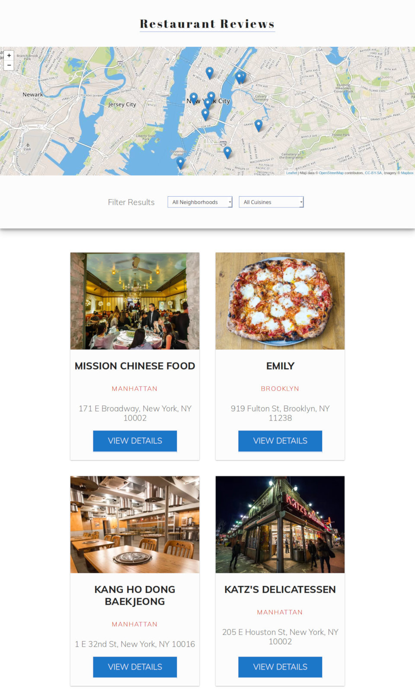

# Restaurant Reviews App

The **Restaurant Reviews** app is project 6/8 on [Udacity's Front End Nanodegree](https://eu.udacity.com/course/front-end-web-developer-nanodegree--nd001).

The objective of this project was to refactor the code for a restaurant reviews website. Initially, the website was barely usable on a desktop browser, much less a mobile device (for example, the listings on the main page were a really long vertical list). I worked on first making it responsive, by implementing fluid typography techniques and a simple flexbox grid.

Afterwards, I worked on implementing standard accessibility features, and registering a basic service worker with offline caching. This project felt easy to tackle, and it was not overwhelming. I love that it felt like a practical review of everything I learned in the past 2 parts of the nanodegree.

### Project Requirements

Take a static design that lacks accessibility and make it responsive on different displays sizes and accessible for screen reader use. Additionally, a service worker needs to be registered and basic offline caching implemented.

Use this [rubric](https://review.udacity.com/#!/rubrics/1090/view) for specific FEND project requirements.

### Running 'Restaurant Reviews' locally

To run this app locally, you need to have [Python](https://www.python.org/) installed on your machine.

1.  Download the zip file or git clone this repository.

2.  In a terminal, check the version of Python you have with `python -V`. If you have Python 2.x, type `python -m SimpleHTTPServer 8000`. For Python 3.x, type `python3 -m http.server 8000`.

3.  With your server running, visit `http://localhost:8000`.

### Tech used

- ES6 Vanilla JavaScript
- Service Worker and Cache API
- [Leaflet.js](https://leafletjs.com/)
- [MapBox API](https://www.mapbox.com/)
- CSS Variables
- CSS Locks for fluid typography [1][link1] [2][link2] [3][link3]
- Fukol inspired Flexbox grid [4][link4] [5][link5]

[link1]: https://silvantroxler.ch/2018/relative-css/
[link2]: https://www.smashingmagazine.com/2016/05/flulink-typography/
[link3]: https://websemantics.uk/tools/responsive-font-calculator/
[link4]: https://github.com/Heydon/fukol-grids
[link5]: https://philipwalton.github.io/solved-by-flexbox/demos/grids/

